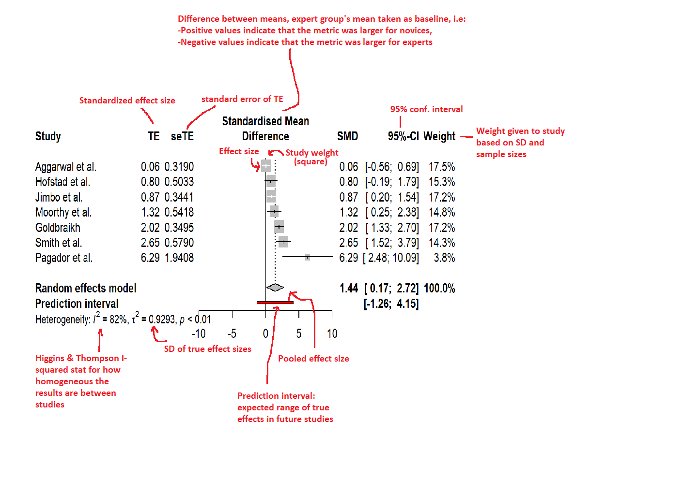

# **Introduction**

## What is this

This notebook will include informal meta-analyses of different metrics and methods
for evaluating surgical skill.


>**The reported metrics compare differences between novices and expert surgeons.**


It is informal because it's not based on systematic review,
and because some studies have been included with very relaxed conditions. For example,
I have picked the novices and experts without comparing their definitions between studies. 
Novice = weakest skill group in the study, expert = strongest skill group in the study.
If a study included more than 2 groups, I picked the weakest (=novice) and strongest (=expert)
groups' results and discarded the others. If a study included more than 1 task, or several sub-tasks, I picked the one with largest difference between groups.

**Many papers did report means and standard deviations explicitly, so they had to be estimated from boxplots/barplots, or by some other means**

For example, sometimes studies reported only mean or median, but no SE/SD. I estimated the SD/SE in those cases based e.g. on the SD of some other similar metric that they reported, or the SD of previous results for the same metric. **See the excel file for notes on each study.**

May or may not be turned into more systematic meta-analysis later.

Example metrics that will be most likely included (Bolded ones have priority)

- **Task time**
- **Tool Path length**
- Tool Velocity
- Tool Acceleration
- Tool Curvature
- **Idle time**
- **Pupil dilations**
- **Blinks**
- **Tool Movement efficiency**
- **Number of movements**
- Tool Forces
- Tool Torques
- **Bimanual dexterity**
- **Jerk**
- Fixation duration
- Saccade amplitudes
- EEG?
- **Surgical Evaluation Instruments (SEI)**

Full list of papers and metrics can be found in the excel file shared in the repo:

[Link to Github repo](https://github.com/jpkos/surg-mveta)

*Last update: 19.7.2022.*: Added more results. Changed Laparoscopy -> Endoscopy, so all endoscopic procedures are labeled 'endoscopy'

## Submit results

If you notice errors or know some good studies to be included, feel free to forward them to

jani.koskinen [ at ] uef.fi

or use the form below TBD
<!--
<iframe src="https://docs.google.com/forms/d/e/1FAIpQLSdZQOqK2r6j1hXMFhraIdsLXZebgS8va0-Vbv7-v5_eSoiBSg/viewform?embedded=true" width="640" height="640" frameborder="0" marginheight="0" marginwidth="0">Loading…</iframe> -->


## How results are calculated

1. From each study, extract
  + Number of trials per group (Nn, Ne, for novices and experts, respectively)
  + Means per group (Mn, Me for novices and experts, respectively)
  + Standard deviations per group (SDn, SDe)
2. Calculate pooled standard deviation SDpooled
3. Normalize by calculating Standardized Mean Difference (SDM): (Mn - Me)/SDpooled
4. Calculate small sample size correction g = SMD*(1 - 3/(4n - 9)), where n is the total sample size of the study (both groups combined).
5. Calculate SDg, standard deviation after correction

These values are used as input in the R *meta* package's metagen function.

For more information, check:

[Doing Meta-Analysis with R: A Hands-On Guide](https://bookdown.org/MathiasHarrer/Doing_Meta_Analysis_in_R/)

## Forest plots



## Summary of Included Studies

Some general statistics of the studies included:
```{r, results='hide', message=FALSE, echo=FALSE, warning=FALSE}
library(readxl)
library(knitr)
library(stargazer)
library(ggplot2)
```
```{r, results='hide', message=FALSE, echo=FALSE, warning=FALSE}
data_path <- 'data/surgical_metrics.xlsx'
sheets <- excel_sheets(data_path)
all_data <- lapply(sheets, read_excel, path=data_path)
all_data <- do.call(rbind, all_data)
all_data <- all_data[,c('Author', 'Year', 'Study', 'Journal', 'Technique')]
unique_studies <- all_data[!duplicated(all_data['Study']),]
```

```{r, results='hide', message=FALSE, echo=FALSE, warning=FALSE}
kb <- kable(table(unique_studies$Technique))
nmetrics <- list()
ntechniques <- list()
i <- 1
for (sheet in sheets){
  nrx <- nrow(read_excel(data_path, sheet=sheet))
  if (nrx<5) next
  nmetrics[[i]] <- as.numeric(nrx)
  ntechniques[[i]] <- sheet
  i <- i + 1
  #cat(sheet, ":", nrx, "\n")
}
nmetrics.df <- data.frame(cbind(ntechniques, nmetrics))
colnames(nmetrics.df) <- c('Technique', 'Count')
```
> Number of unique studies: **`r nrow(unique_studies)`**

> Number of studies by surgical technique: `r kb`

> Number of studies by metric: `r kable(nmetrics.df)`

```{r, message=FALSE, echo=FALSE, warning=FALSE}
ggplot(unique_studies, aes(x=Year)) + geom_bar() + scale_x_continuous("Year") + scale_y_continuous("Number of studies")
```


## Sample size estimation (Work in progress)


```{r, results='hide', message=FALSE, echo=FALSE, warning=FALSE}
library(pwr)
library(ggplot2)
library(plotly)
```

How many samples needed at some effect size d? At alpha = 0.05 and power = 0.8 and using t-test. Assuming independent trials (e.g. no multiple measurements from same participants etc.)

```{r, results='hide', message=FALSE, echo=FALSE, warning=FALSE}
#TBD: teach yourself how to do this more easier in R
j <- 1
ds <- seq(0.3,4,0.01)
ns <- list()
ns_full <- list()
pss <- c(0.6, 0.7, 0.8, 0.9)
pslist <- list()
for (ps in pss){
  i <- 1
  ns <- list()
  for (d in ds){
    poweranalysis <- pwr.t.test(d=d, sig.level=0.05, power=ps)
    ns[i] <- poweranalysis$n
    i <- i + 1
  }
  ns_full <- cbind(ns_full, ns)
  pslist <- cbind(pslist, rep(ps, length(ns)))
  j <- j + 1
}
df.sample <- data.frame(cbind(as.numeric(ns_full), as.numeric(ds)), as.numeric(pslist))
colnames(df.sample) <- c("sample_size", "effect_size", "power")

```

Hover mouse over the points in the plot to see the values. **Sample size is for group, so you need this many samples per group**

Some baseline effect sizes from the meta-analyses given as baseline:

IT = Idle Time

TT = Task Time

BD = Bimanual Dexterity

TEPR = Task-Evoked Pupil Reaction/Dilation (Esimated without one outlier study removed)

TJ = Tool Jerk

TF = Tool Force

```{r, warning=FALSE, message=FALSE, echo=FALSE}
p <- ggplot(data=df.sample, aes(x=effect_size, y=sample_size, color=as.factor(power))) + geom_line() + scale_y_continuous(breaks = scales::pretty_breaks(n = 20)) + scale_x_continuous(breaks = scales::pretty_breaks(n = 20)) + labs(x="Effect size d", y="Sample size n", color="Power") + 
  geom_vline(xintercept=2.5, color='red') + annotate("text", x=2.6, y=150, label="TT", color='red') +
  geom_vline(xintercept=1.4, color='red') + annotate("text", x=1.5, y=150, label="IT", color='red') + 
  geom_vline(xintercept=3.3, color='red') + annotate("text", x=3.4, y=150, label="BD", color='red') +
  geom_vline(xintercept=0.6, color='red') + annotate("text", x=0.7, y=150, label="TEPR", color='red') + 
  geom_vline(xintercept=0.7, color='red') + annotate("text", x=0.8, y=170, label="TJ", color='red') +
  geom_vline(xintercept=1.6, color='red') + annotate("text", x=1.7, y=170, label="TF", color='red') +
  geom_vline(xintercept=2.6, color='red') + annotate("text", x=2.7, y=170, label="OSATS", color='red') 

ggplotly(p)
```


